# MIRASWEAR

> E-commerce completo com catalogação de produtos, carrinho, checkout Stripe e painel administrativo, construído com Next.js (App Router), Drizzle ORM e Postgres.

## Sumário

- [Visão geral](#visão-geral)
- [Stack principal](#stack-principal)
- [Funcionalidades](#funcionalidades)
- [Estrutura de pastas](#estrutura-de-pastas)
- [Configuração rápida](#configuração-rápida)
- [Variáveis de ambiente](#variáveis-de-ambiente)
- [Banco de dados](#banco-de-dados)
- [Scripts úteis](#scripts-úteis)
- [Qualidade de código](#qualidade-de-código)
- [Documentação adicional](#documentação-adicional)
- [Contribuição](#contribuição)
- [Licença](#licença)

## Visão geral

O MIRASWEAR oferece uma experiência completa de e-commerce:

- Catálogo com categorias, variantes e tamanhos.
- Busca responsiva com destaque no header e página dedicada.
- Carrinho persistente, cálculo de estoque e migração entre dispositivos.
- Fluxo de checkout integrado ao Stripe (sessão de pagamento, webhook e reservas de estoque).
- Painel administrativo para gestão de produtos, estoque e usuários.
- Autenticação baseada em Better Auth com controle de administradores.

## Stack principal

- **Framework**: Next.js 15 (App Router) com React 19.
- **Banco de dados**: Postgres + Drizzle ORM / Drizzle Kit.
- **UI/UX**: Tailwind CSS 4, Radix UI, Lucide Icons, Sonner (toasts).
- **Estado**: React Query (TanStack) e hooks customizados.
- **Pagamentos**: Stripe (checkout e webhooks).
- **Formulários/Validação**: React Hook Form + Zod.
- **Autenticação**: Better Auth (sessions + adapters customizados).

## Funcionalidades

- Catálogo com variantes, tamanhos e gerenciamento de estoque.
- Busca instantânea com fallback para pagina de resultados.
- Carrinho sincronizado (local + usuário autenticado) e migração automática.
- Checkout seguro via Stripe com reservas temporárias de estoque.
- Histórico de pedidos e gerenciamento de endereços.
- Painel admin para ativar/desativar produtos, controlar estoque e permissões.
- Validações BR (CPF, CEP, telefone) e tratativas para estoque esgotado.

## Estrutura de pastas

```text
src/
	app/                  # Rotas (App Router) para catálogo, checkout, dashboard, etc.
	actions/              # Ações server-side (cart, checkout, estoque, administração)
	components/           # Componentes reutilizáveis (UI + common)
	db/                   # Integração Drizzle (schema, seeds, connection)
	helpers/              # Utilidades como formatadores e validações BR
	hooks/                # Hooks para estado do carrinho, busca, React Query
	lib/                  # Autenticação, utils e logger
	providers/            # Providers globais (React Query, tema)
```

Outros arquivos relevantes:

- `drizzle/` – Migrações geradas.
- `run-seed.js` – Script de seed completo do catálogo.
- `docs/der.md` – Derivação do diagrama entidade-relacionamento.

## Configuração rápida

### Pré-requisitos

- Node.js 20+ (recomendado pelo Next 15).
- Gerenciador de pacotes: `pnpm` (preferencial) ou `npm`/`yarn`.
- Banco Postgres acessível (local ou remoto).

### Passos

1. Instale dependências:

   ```bash
   pnpm install
   ```

2. Configure as variáveis no `.env.local` (ver tabela abaixo).

3. Execute migrações e seed (opcional, ver [Banco de dados](#banco-de-dados)).

4. Suba o servidor de desenvolvimento:

   ```bash
   pnpm dev
   ```

5. Acesse [http://localhost:3000](http://localhost:3000).

## Variáveis de ambiente

| Variável                             | Obrigatória   | Descrição                                                         |
| ------------------------------------ | ------------- | ----------------------------------------------------------------- |
| `DATABASE_URL`                       | ✅            | URL de conexão Postgres usada pelo Drizzle e Better Auth.         |
| `BETTER_AUTH_SECRET`                 | ✅            | Chave secreta usada para assinar tokens/sessões do Better Auth.   |
| `BETTER_AUTH_URL`                    | ⚠️            | Base URL exposta pelo app (default `http://localhost:3000`).      |
| `NEXT_PUBLIC_APP_URL`                | ✅ (checkout) | URL pública usada nas callbacks do Stripe.                        |
| `NEXT_PUBLIC_STRIPE_PUBLISHABLE_KEY` | ✅ (checkout) | Chave pública para inicializar o Stripe no frontend.              |
| `STRIPE_SECRET_KEY`                  | ✅ (checkout) | Chave secreta usada para criar sessões de pagamento.              |
| `STRIPE_WEBHOOK_SECRET`              | ✅ (webhook)  | Secret do endpoint `/api/stripe/webhook`.                         |
| `INVENTORY_STRICT`                   | opcional      | Quando `true`, bloqueia checkouts sem estoque mapeado.            |
| `RESERVATION_MINUTES`                | opcional      | Tempo (min) de reserva de estoque após criar pedido (default 15). |

> Crie um arquivo `.env.local` baseado nesse quadro antes de iniciar o projeto.

## Banco de dados

- **Gerar migrações** (a partir do schema Drizzle):

  ```bash
  pnpm db:generate
  ```

- **Executar migrações**:

  ```bash
  pnpm db:migrate
  ```

- **Seed** (recria catálogo completo):

  ```bash
  pnpm db:seed
  ```

- **Inspecionar com Drizzle Studio** (opcional):

  ```bash
  pnpm db:studio
  ```

## Scripts úteis

| Comando       | Descrição                                                        |
| ------------- | ---------------------------------------------------------------- |
| `pnpm dev`    | Inicia o servidor Next.js em modo desenvolvimento na porta 3000. |
| `pnpm build`  | Gera o build de produção.                                        |
| `pnpm start`  | Sobe o servidor em modo produção (requer build prévio).          |
| `pnpm lint`   | Executa linting com ESLint + regras de importação.               |
| `pnpm format` | Formata código com Prettier (inclui Tailwind).                   |
| `pnpm db:*`   | Scripts auxiliares do Drizzle (generate, migrate, studio, seed). |

## Qualidade de código

- ESLint com `eslint-config-next` e `simple-import-sort`.
- Prettier com plugin Tailwind para ordenar classes utilitárias.
- Tipagem TypeScript estrita (`tsconfig.json`).
- Recomenda-se habilitar "ESLint: Fix on Save" no VS Code (ver `.vscode/settings.json`).

## Documentação adicional

- **DER**: `docs/der.svg` (imagem) e [`docs/der.md`](./docs/der.md) (Mermaid + notas).
- **Schema Drizzle**: `src/db/schema.ts` centraliza todas as tabelas e relações.
- **Ações do servidor**: `src/actions/*` documenta os flows críticos (cart, checkout, admin).

## Diagrama entidade-relacionamento

<p align="center">
  
</p>

## Contribuição

Pull requests são bem-vindos! Antes de enviar:

1. Garanta que os comandos abaixo foram executados sem erros:

   ```bash
   pnpm lint
   pnpm build
   ```

2. Descreva claramente a mudança e passos para testar.
3. Prefira commits pequenos e mensagens no padrão `feat:`, `fix:`, `chore:` etc.

---

Caso tenha dúvidas ou identifique pontos de melhoria, abra uma issue ou entre em contato com a equipe MIRASWEAR.

## Licença

Este projeto está licenciado sob a [MIRASWEAR Custom Non-Commercial License](./LICENSE); leia o arquivo `LICENSE` para conhecer todos os termos.

- O uso é restrito a finalidades não comerciais (sem revenda, licenciamento pago ou oferta como serviço).
- Qualquer redistribuição deve incluir esta licença, avisos de copyright e o código-fonte completo das modificações.
- Implantações acessíveis via rede devem disponibilizar o código-fonte para os usuários que interagirem com o projeto.
- Para licenciamento comercial ou dúvidas específicas, entre em contato com o autor indicado no arquivo `LICENSE`.
