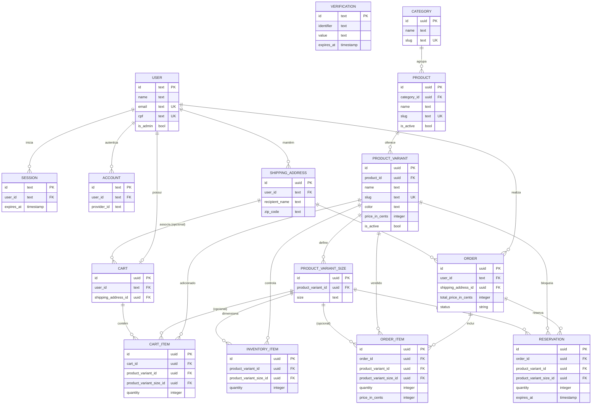

# Diagrama Entidade-Relacionamento (DER)

Este documento descreve as entidades e relacionamentos principais do banco de dados MIRASWEAR conforme definido em `src/db/schema.ts`. O diagrama abaixo está em formato [Mermaid](https://mermaid.js.org/) e pode ser renderizado diretamente em plataformas compatíveis (VS Code com extensão apropriada, GitHub, etc.).

## Notas adicionais

- O campo `status` da tabela `order` representa o enum `order_status` (`pending`, `processing`, `paid`, `shipped`, `delivered`, `canceled`).
- Tabelas de autenticação (`session`, `account`, `verification`) fazem parte da integração com o sistema de login e não se relacionam diretamente com o domínio de pedidos além do vínculo com `user`.
- Alguns relacionamentos no schema permitem `NULL` (por exemplo, endereço associado ao carrinho, tamanho da variante em itens). Esses casos continuam opcionais mesmo sem a marcação direta no diagrama.

Para editar o diagrama, ajuste o bloco Mermaid acima. Você pode validar o resultado abrindo o arquivo no VS Code com uma extensão Mermaid ou visualizando via `npx @mermaid-js/mermaid-cli` se preferir gerar imagens.
